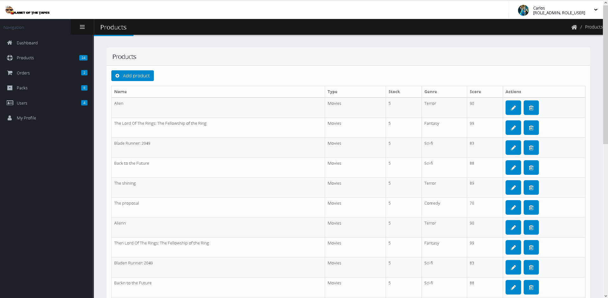
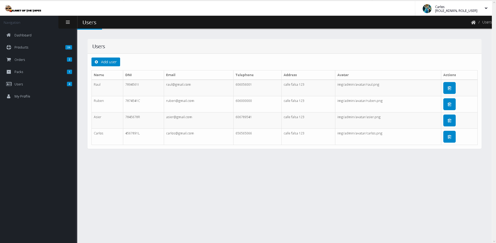
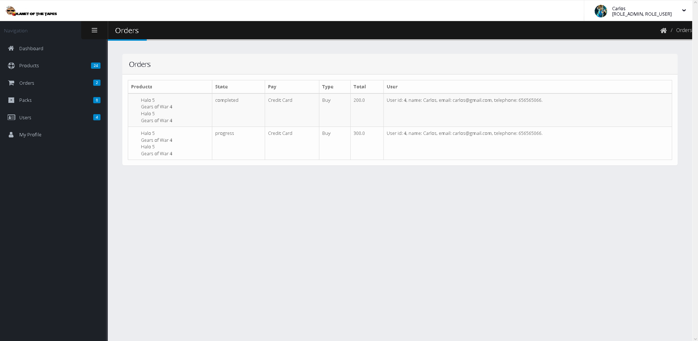
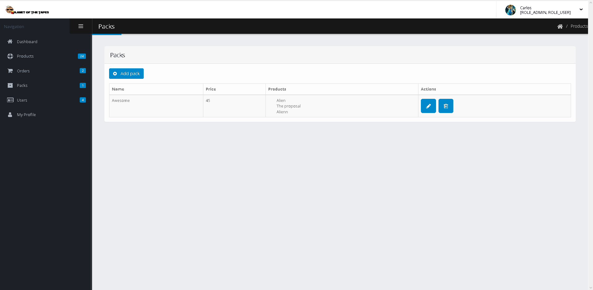
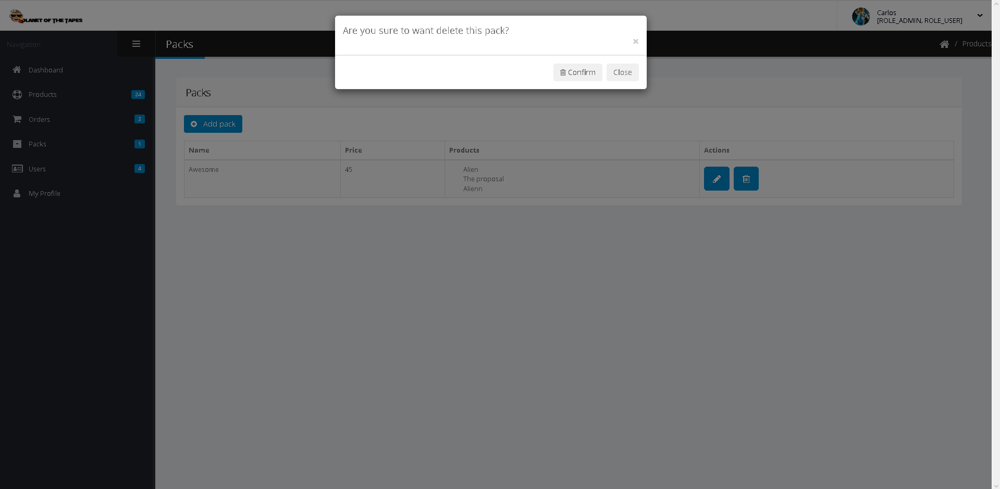
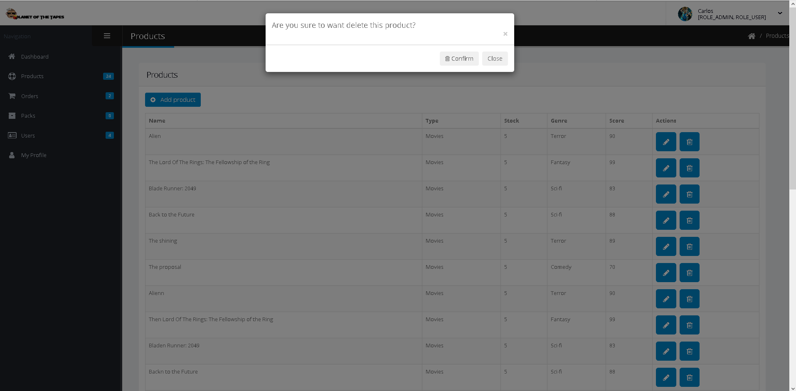
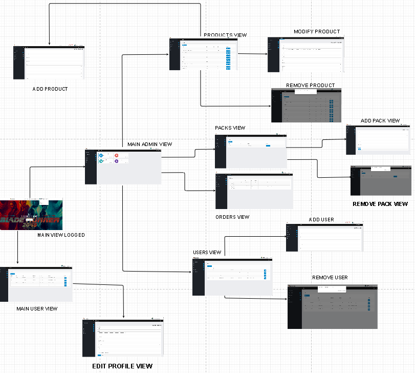

# PLANET OF THE TAPES
###### Hi everyone, welcome to the Planet of the Tapes!!
------------
Authors:
------------
```
Rubén Calvo Martinez    r.calvoma@alumnos.urjc.es        Github User: Casanova2      
Raúl Iglesias González  rb.iglesias@alumnos.urjc.es      Github User: raulig22     
Carlos López García     c.lopezgarcia2@alumnos.urjc.es   Github User: CarlosLopGarcia   
Asier Ruano Peñas       a.ruano@alumnos.urjc.es          Github User: AsierRuano  
```
We are a small group from URJC university in Spain and we are doing this web app for Web Aplications Development.  
**We will be working on a videoclub. The costumers will be able to buy films, videogames and series.**  

# Phase 1  
In this phase we will show you the entities of the database, the external technologies that will be used and the advanced functionalities of our project.     
       
For a better work organization, we will use Trello. Here is the link: [Trello table](https://trello.com/b/mblOwpgb/planet-of-the-tapes)        
  
## External Technologies
* Facebook Page
* Google Maps Location  
* Mail suscription 

## Data Base Entities
> User  
> Products  
> Orders  
> Packs  
------------
## Advanced Functionality     
* Personalized recommendations    
------------

# Phase 2  
In this phase, we will show you the layouts for our web. We have made only the HTML and CSS implementation.

These are the screens that we have created:  
  
* Main screen[index]: This screen will be displayed when starting the web page. Here, you can choose between games, movies
and series section. Also, you can go to our facebook page by clicking the "Facebook" button, or log in for start renting.  
  
  
* Product List screen[products]: In this screen, we can see the product list depends on series, movies or videogames.  
  
  
* Product screen[product]: In this screen, you can see a detailed description of the product you have chosen before.  
(series, movies or games). If you are logged, you can start the rent of the product.   


  
* Log In/Register screen[register]: In this screen, you will be able to log in in our page, or register if you are not a member of this awesome community.  
  

* Contact screen[contact]: Here, the users can know more about us and where we are.  
  
  
* Cart screen[cart]: You will go to this screen only if you are a registered user. Here, you can see your orders and pay for them.  
  


Now, we will show you a simple navigation diagram from the main page, though you can go wherever you want from every page.  
  
  
# Phase 3

In this phase, we have implemented the app with functionality in Spring. If you want to run it, you have to import the project in your Spring Tool Suite, and run as Spring boot application.
Once the application is started, you have to write this in your browser to accede our app: "https://localhost:8443".

We have made some changes in our view, and we have created some other news. Here are the pictures of these changes:

* Register View:    
  
  
* Login View:  
  
  
* Main View with user/admin logged:  
  
  
* Admin Main View:  
  
  
* User Main View:  
  
  
* Admin products view:  
  
  
* Admin User list:  
  
  
* Admin Orders View:  
  
  
* Admin Packs View:  
  
  
* Admin Add Pack View:  
  
  
* Admin Remove Pack View:  

  
* Admim Add Product View:  
  
  
* Admin Remove Product View:  
  
  
* Admin Modify Product View:  
  
  
* Admin Add User View:  
  
    
* Admin Remove User View:  
  
  
* Cart in Main View:  
  
  
* Enter Payment Data View:  
  
  
We have update our navigation diagram too. Here are 2 different diagrams. First one is th "main view", one in which you can purchase products by login and visit the web.  
The second one is the admin/user view. Once you are looged as admin or user, you canmanage your account or the products and users in the app.  
  
*   
  
*     
  
  
Also, here is the diagram with database entities relations:

  
  
To finish, we have made class diagrams by parts to connect the classes of our application and the views that compose it:  
  
## Inheritance  
  
*   
  
*   
  
*   
  
## Autowired Relations between Controllers, Repositories and Entities  
  
*   
  
*   
  
*   
  
## Relation between Entities  
  
*   
  
## Relation between Controllers and HTML Views  
  
*   
  
*   
  
# Phase 4  
  
In this phase, we have implemented an API REST app, and we have built this with dockers.  
  
If you want to see the API REST documentation [click here](https://github.com/Casanova2/planet_of_the_tapes/tree/develop/API.md).  
If you want to see the DOCKER documentation [click here](https://github.com/Casanova2/planet_of_the_tapes/tree/develop/DOCKER.md).  

We have created a diagram with the new controllers and their dependencies:
* 

